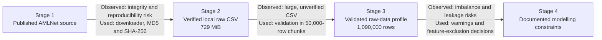

# PaymentGuard

PaymentGuard is a one-month data and risk analytics project studying decision-making under digital-payment fraud risk.

## Research question

How should a payment company approve, review, or block transactions to reduce fraud losses without rejecting too many genuine customers, particularly when manual-review capacity is limited?

## Why this problem matters

A useful fraud-risk system must balance competing consequences: financial loss from undetected fraud, customer inconvenience caused by false alarms, and the operational cost of manual review. Therefore, predictive accuracy alone is not enough. The final decision policy must account for probabilities, costs, and operational constraints.

## Completed Data-Acquisition and Validation Workflow

Before starting data cleaning or modelling, I treated the raw dataset as a sequence of verifiable states. I first reproduced and verified the download, then validated all 1.09 million transactions in memory-controlled chunks. This stage did not produce a cleaned or model-ready dataset. It produced a validated raw-data profile and identified the restrictions that must guide the next stage.

The first transition is implemented in [`download_amlnet_v2_data.py`](src/payment_guard/download_amlnet_v2_data.py). The second and third transitions are supported by [`validate_amlnet_v2_data.py`](src/payment_guard/validate_amlnet_v2_data.py). Dataset provenance, licence information and checksum values are recorded in the [AMLNet Version 2.0 raw-data documentation](data/raw/amlnet_v2/README.md).

## Initial scope

- Design and query a relational transaction database using SQL.
- Analyse transaction behaviour over time.
- Construct interpretable fraud-risk baselines.
- Use chronological validation to prevent future information from entering past predictions.
- Compare approve, review, and block decisions through explicit costs.
- Study data drift and changes in transaction behaviour.
- Communicate results through curves, heatmaps, risk surfaces, and an interactive dashboard.
- Analyse algorithmic runtime, memory requirements, and possible improvements.

## Research practice

- Every code component, mathematical argument, and result must be understood and reproducible.
- Datasets, papers, definitions, and externally adapted ideas must be cited.
- Synthetic data must always be identified as synthetic.
- Results must not be invented, exaggerated, or reported without validation.
- Assumptions, limitations, and negative findings must be documented.
