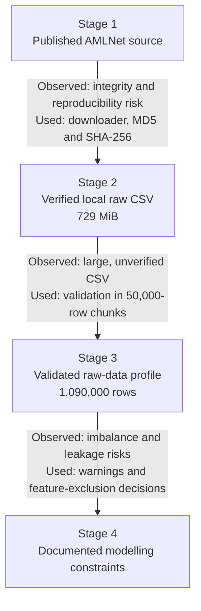
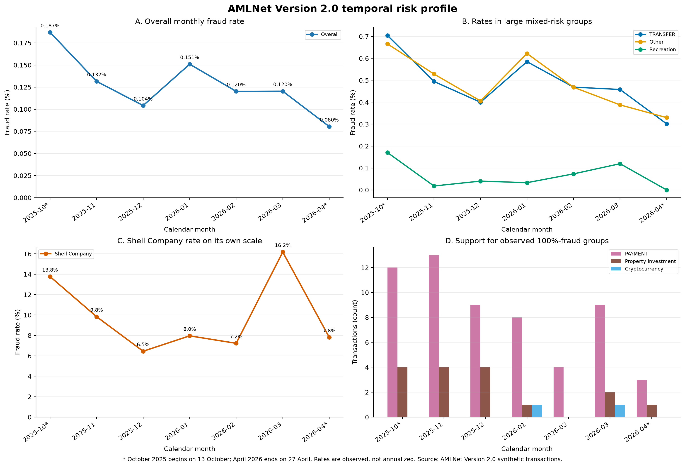
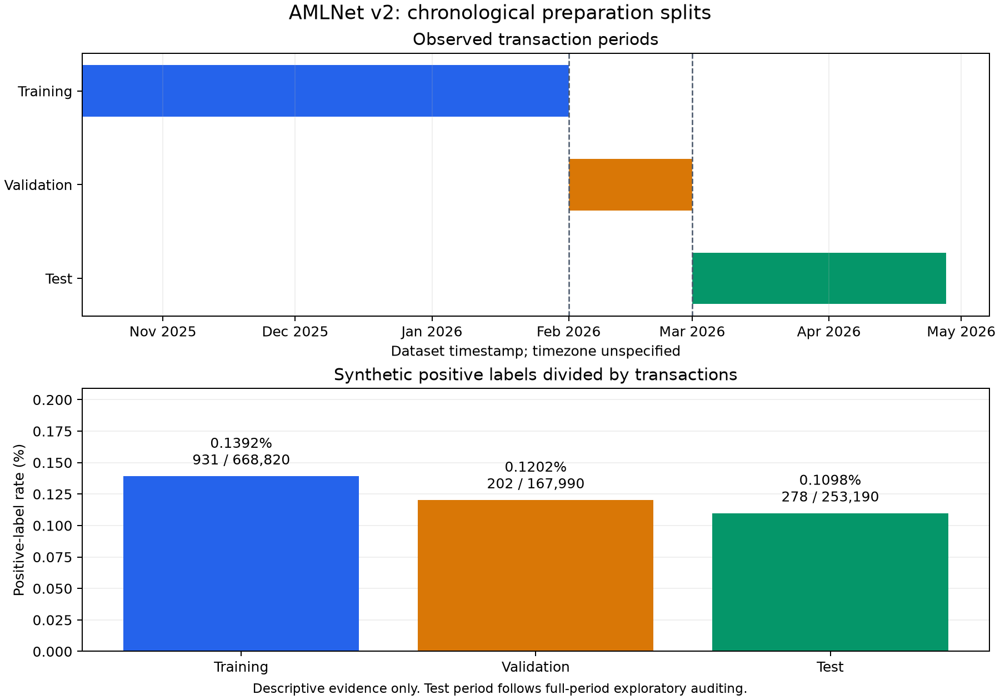

# PaymentGuard

> **Independent project notice:** PaymentGuard is an independent portfolio research project and is not affiliated with any commercial product using a similar name.
Payment-fraud risk study in progress. Raw data audited; the prepared transaction table and chronological splits are verified. Modelling and the approve, review, block policy are still planned.

## Research question

How should a payment company approve, review, or block transactions to reduce fraud losses without rejecting too many genuine customers, particularly when manual-review capacity is limited?

## Why this problem matters

A useful fraud-risk system must balance competing consequences: financial loss from undetected fraud, customer inconvenience caused by false alarms, and the operational cost of manual review. Therefore, predictive accuracy alone is not enough. The final decision policy must account for probabilities, costs, and operational constraints.

## Completed Data-Acquisition and Validation Workflow

Before starting data cleaning or modelling, I treated the raw dataset as a sequence of verifiable states. I first reproduced and verified the download, then validated all 1.09 million transactions in memory-controlled chunks. This stage did not produce a cleaned or model-ready dataset. It produced a validated raw-data profile and identified the restrictions that must guide the next stage.

```mermaid
flowchart TB
    A["Stage 1<br/>Published AMLNet source"]
    B["Stage 2<br/>Verified local raw CSV<br/>729 MiB"]
    C["Stage 3<br/>Validated raw-data profile<br/>1,090,000 rows"]
    D["Stage 4<br/>Documented modelling constraints"]

    A -->|"Observed: integrity and reproducibility risk<br/>Used: downloader, MD5 and SHA-256"| B
    B -->|"Observed: large, unverified CSV<br/>Used: validation in 50,000-row chunks"| C
    C -->|"Observed: imbalance and leakage risks<br/>Used: warnings and feature-exclusion decisions"| D
```

The first transition is implemented in [`download_amlnet_v2_data.py`](src/payment_guard/download_amlnet_v2_data.py). The second and third transitions are supported by [`validate_amlnet_v2_data.py`](src/payment_guard/validate_amlnet_v2_data.py). Dataset provenance, licence information and checksum values are recorded in the [AMLNet Version 2.0 raw-data documentation](data/raw/amlnet_v2/README.md).

## Completed Schema, Leakage and Temporal Risk Audit

Before preparing model-ready data, I audited the 17 top-level columns and 47 paths found inside the nested metadata. The audit showed that file order is not chronological and that several metadata groups directly reveal the supplied fraud label. I excluded those target-revealing fields rather than allowing a model to learn information that would not be available in a real transaction decision.

I then profiled the unresolved device, location and merchant fields and measured how fraud rates changed across the seven observed months. This evidence was combined into an initial feature policy:

| Resolved policy | Fields | How I will use them |
|---|---:|---|
| Include | 7 | Direct baseline features |
| Include with assumption | 4 | Use only with documented decision-time availability |
| Include with ablation | 2 | Compare results with and without these fields |
| Derive with history | 4 | Calculate only from earlier transactions |
| Exclude initially | 1 | Leave out of the first baseline |
| Split only | 1 | Use for chronological ordering |
| Target | 1 | Use only as the prediction outcome |
| Exclude | 44 | Do not use as initial predictors |

The figure below shows the temporal evidence used in this decision. October 2025 and April 2026 are partial months, and the rare deterministic groups are displayed separately from the larger mixed-risk groups.

The detailed reasoning is recorded in the [data workspace](docs/data_workspace.md). Reproducible evidence is available in the [leakage audit](results/tables/amlnet_v2_leakage_audit.csv), [candidate metadata profile](results/tables/amlnet_v2_candidate_metadata_profile.csv), [temporal risk profile](results/tables/amlnet_v2_temporal_risk_profile.csv), and [initial model feature policy](results/tables/amlnet_v2_initial_model_feature_policy.csv).

## Completed Transaction Preparation

I prepared all 1,090,000 transactions using 13 candidate predictors
from my audited feature policy. I validated required values, preserved
source-row references, sorted by timestamp and assigned fixed
chronological training, validation and test periods.

I reconciled 1,411 positive labels and independently verified the
saved Parquet table. The preparation tests passed all 32 cases.
The full run took 61.01 seconds on my Mac, with 925.14 MiB peak
process memory.

My [data-handling account](docs/data_preparation.md) explains the
sequence, the findings that required intermediate checks, mathematical
conditions, computational costs and remaining limitations.
The [split summary](results/tables/amlnet_v2_split_summary.csv)
records aggregate evidence.

The test period is a chronological holdout after exploratory auditing.
The data remain synthetic; this stage does not establish production
fraud-detection performance.

### Chronological split visualization

I use the upper panel to show the observed split periods and the lower panel to compare empirical positive-label rates. These describe synthetic data; they do not establish statistical significance or model performance.

I reproduce the figure from the aggregate split summary using `PYTHONPATH=src python -m payment_guard.plot_amlnet_v2_splits`.

## Initial scope

- Design and query a relational transaction database using SQL.
- Analyse transaction behaviour over time.
- Construct interpretable fraud-risk baselines.
- Use chronological validation to prevent future information from entering past predictions.
- Compare approve, review, and block decisions through explicit costs.
- Study data drift and changes in transaction behaviour.
- Communicate results through curves, heatmaps, risk surfaces, and an interactive dashboard.
- Analyse algorithmic runtime, memory requirements, and possible improvements.

## Research practice

- Every code component, mathematical argument, and result must be understood and reproducible.
- Datasets, papers, definitions, and externally adapted ideas must be cited.
- Synthetic data must always be identified as synthetic.
- Results must not be invented, exaggerated, or reported without validation.
- Assumptions, limitations, and negative findings must be documented.

## SQLite validation

The prepared transactions were imported into SQLite and checked using the
four saved queries in `sql/`. The [SQL validation account](docs/sql_validation.md)
records the observed totals, explains the reusable converter, and distinguishes
manual summary checks from the pending full-dataset value-by-value comparison.
