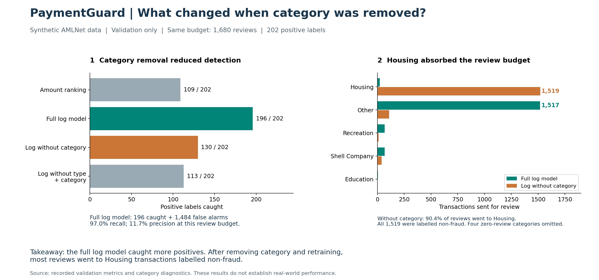

# PaymentGuard

I am studying how to rank payment transactions for fraud review when only a small share can be checked. I started with data validation and SQL exploration, then compared two logistic regression baselines with simple reference rankings.

**Current milestone: baseline and feature-ablation comparisons, category error analysis, and two individual score reconstructions are complete.** This is an independent portfolio research project using synthetic AMLNet v2 data. It is not a deployed fraud-detection service or affiliated with a commercial product of the same name.

## First result

I trained on 668,820 earlier transactions and evaluated on 167,990 transactions from February 2026, including 202 positive labels. At the predeclared 1% review budget, each approach flagged exactly 1,680 transactions.

| Approach | Fraud labels caught | False alarms | Precision | Recall |
| --- | ---: | ---: | ---: | ---: |
| Constant training prevalence | 4 | 1,676 | 0.24% | 1.98% |
| Largest amounts first | 109 | 1,571 | 6.49% | 53.96% |
| Logistic regression: raw amount | 188 | 1,492 | 11.19% | 93.07% |
| Logistic regression: log amount | 196 | 1,484 | 11.67% | 97.03% |

The log-amount model caught 196 of 202 fraud labels, but most of its flags were false alarms. **97.03% is recall, not accuracy or the percentage of flags that were correct.** The constant reference has identical scores for every transaction; its result comes from one fixed, label-independent random tie order.


At 840 reviews, the log model caught 194 positives. Doubling the workload to 1,680 added two positives and 838 false alarms. That trade-off is why I want to study review costs before choosing a decision policy. It does not establish an optimal budget.

The [results account](docs/logistic_baseline_first_results.md) includes all three declared budgets, average precision, probability losses, convergence records and limitations. These results came from my local run at commit `28f1de7`. The committed [aggregate counts](results/tables/logistic_baseline_review_counts.csv) were transcribed from its printed metrics; model files and row-level predictions remain local.

## What the category investigation showed



At the same 1,680-review budget, removing category and refitting the log model
reduced caught positives from 196 to 130. Housing then used 1,519 reviews, all
labelled non-fraud. This helped me see where review capacity went, rather than
looking only at the overall recall. The full model still produced 1,484 false
alarms; its stronger recall did not make most alerts correct.

I also reconstructed two Housing predictions around the cutoff from their
transformed inputs, fitted coefficients and intercept. Their probabilities
were almost identical, but the review budget selected rank 1,680 and excluded
rank 1,681. The [visual guide](docs/visual_results_guide.md) explains both
figures, including the separate technical score breakdown, its equations and
limitations. The [score analysis](docs/housing_score_contributions.md) records
the local checks and the [category error account](docs/validation_category_errors.md)
provides the wider breakdown.

## What I built

- **Verified data preparation:** audited 1,090,000 synthetic transactions and reconciled 1,411 positive labels; preserved source references and assigned chronological splits.
- **Leakage review:** examined nested metadata and excluded supplied risk scores, duplicate targets, post-transaction balances and annotations that reveal the target.
- **SQLite and SQL analysis:** checked the imported table against every prepared value, then explored training-period amounts, transaction types, transfers and monthly fraud rates.
- **Baseline experiment:** compared raw and log-transformed amounts using the same logistic model settings, plus constant-prevalence and amount-ranking references.
- **Reproducible evaluation:** saved local model artifacts, predictions, dependency versions, hashes and convergence records; published aggregate results and a plotting script. The expanded suite contains 72 passing tests at this checkpoint.

## Why this comparison

I chose logistic regression as a first interpretable fitted baseline. It lets me examine whether the permitted transaction features improve ranking beyond simply reviewing the largest amounts. Changing only the amount transformation gives me a specific comparison to investigate before adding a more complex model.

Both fits use L2 regularization and the same 13 source predictors. Scaling and categorical encoding are fitted on training rows only. Calendar cycles use fixed sine/cosine features. The [experiment plan](docs/baseline_experiment_plan.md), written before the run, explains the mathematical reasoning, feature choices and review budgets.

| Period | Transactions | Positive labels | Role |
| --- | ---: | ---: | --- |
| Before February 2026 | 668,820 | 931 | Fit preprocessing and models |
| February 2026 | 167,990 | 202 | Compare baseline rankings |
| March 2026 onward | 253,190 | 278 | Reserved for later model evaluation |

The present training command reads and scores only training/validation periods. Earlier exploratory auditing did examine the full dataset, so I describe the final period as a chronological holdout after auditing, not an entirely unseen dataset.

## Limits and next questions

The data are fully synthetic. Strong scores may reflect how the dataset was generated; they do not establish performance on real payments. In particular, transaction type and category showed unusually strong label patterns. The completed [feature-removal comparison](docs/feature_ablation_results.md) showed substantial dependence on category: at 1,680 reviews, the log model caught 196 positives with all features, 193 without type, 130 without category and 113 without both. Amount ranking caught 109. This is dependence in a synthetic-data validation experiment, not proof of leakage. Device and location features also rely on an explicit assumption that they are available before authorization.

The current evaluation ranks an entire validation batch retrospectively. It does not implement a live threshold, establish calibrated probabilities or measure financial savings. The three review budgets were experiment choices, not measured business capacity. Local artifact hashes have not been independently verified. A subsequent local diagnostic reproduced the without-category confusion counts and reconstructed two saved Housing probabilities; this did not verify every prediction.

I examined training category patterns and validation errors, then reconstructed two Housing scores around the review cutoff. Next I will study probability calibration and the costs of false alarms and missed fraud. Final holdout evaluation, drift analysis and an interactive dashboard remain future work.

## Reproduce or inspect

From a cloned repository, create the project environment and run the tests:

```bash
conda env create --file environment.yml
conda activate payment-guard
PYTHONPATH=src python -m pytest -q
```

The tests use small fixtures and do not require downloading the full dataset. To regenerate the comparison figure from the committed aggregate counts:

```bash
PYTHONPATH=src python -m payment_guard.plot_logistic_baseline
```

For a full training run, follow the [dataset source and download instructions](data/raw/amlnet_v2/README.md), [preparation account](docs/data_preparation.md) and [baseline run instructions](docs/running_logistic_baseline.md). The raw CSV is about 729 MiB; raw data, prepared tables, SQLite databases and model artifacts are excluded from Git. The dataset documentation records its source, checksums and CC BY-NC 4.0 license.

The baseline and ablation runs completed on my Mac; the expanded 72-test suite passed. Run-specific package versions are recorded in the results account and local manifest. `environment.yml` defines the working environment but is not an exact dependency lockfile.

To regenerate the two explanatory figures from recorded aggregate values
(no raw dataset or fitted model is needed):

```bash
python scripts/plot_validation_explanation.py
```

To reproduce the individual score checks with your local prepared data and
saved ablation models:

```bash
PYTHONPATH=src python scripts/explain_housing_cutoff.py
```

## Project guide

| Area | Where to start |
| --- | --- |
| Data audit and feature policy | [Data workspace](docs/data_workspace.md) |
| Preparation and chronological splits | [Preparation](docs/data_preparation.md) · [Split summary](results/tables/amlnet_v2_split_summary.csv) |
| Database verification | [SQLite validation](docs/sql_validation.md) |
| SQL questions and interpretation | [Training exploration](docs/training_sql_exploration.md) · [Saved queries](sql/) |
| Model reasoning | [Experiment plan](docs/baseline_experiment_plan.md) |
| Model execution and outputs | [Run instructions](docs/running_logistic_baseline.md) · [Training code](src/payment_guard/train_logistic_baseline.py) |
| Results and workload chart | [First results](docs/logistic_baseline_first_results.md) |
| Feature-removal comparison | [Ablation results](docs/feature_ablation_results.md) · [Run instructions](docs/running_feature_ablation.md) |
| Visual explanation and score reconstruction | [Visual guide](docs/visual_results_guide.md) · [Housing scores](docs/housing_score_contributions.md) |
| Development history | [Project journal](docs/project_journal.md) |

My broader question is how to connect fraud scores with approve, review and block decisions while accounting for missed fraud, customer inconvenience and review effort. This checkpoint provides the first measured ranking comparison for that work.
