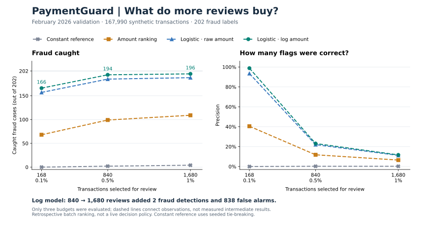

# My first full-data logistic baseline results

## Run evidence

On 6 October 2026 (Asia/Kolkata), I ran the code at commit `28f1de7`
in my `payment-guard-verify` environment on the Mac. The expanded tests
reported **61 passed in 68.18 seconds**. That is the test-suite duration,
not the model training time.

I then ran:

```bash
PYTHONPATH=src python -m payment_guard.train_logistic_baseline
```

The terminal confirmed 668,820 training rows and 167,990 validation rows,
with test rows excluded. Both full-feature fits completed and the command
reported the saved run at `models/logistic_baseline_v1`.

This account initially used the completion output. I then supplied all 12
rows of validation_metrics.csv through Terminal on 6 October 2026. The
confusion counts reconcile to 167,990 validation transactions, 202 positives
and each selected review budget. I later supplied a manifest excerpt: the raw model reported convergence in
90 iterations (3.11 seconds fitting), and the log model in 59 iterations
(2.18 seconds). Both reported zero unknown validation categories, the same
planned settings, and a clean working tree at `28f1de7`. These are single-run
fit timings, not a speed benchmark. The recorded packages were NumPy 2.5.3,
pandas 3.0.6, SciPy 1.18.1, scikit-learn 1.9.1, PyArrow 24.0.0 and joblib 1.6.0.
Artifact hashes and row-level predictions have not been independently checked.

## What happened at the planned review budget

The primary comparison selected 1,680 transactions from the February
validation period for each approach. There are 202 positive labels in
that period. Missed fraud below is calculated as 202 minus caught fraud.

| Approach | Selected | Caught fraud | False alarms | Missed fraud | Precision | Recall |
| --- | ---: | ---: | ---: | ---: | ---: | ---: |
| Constant training rate | 1,680 | 4 | 1,676 | 198 | 0.24% | 1.98% |
| Descending amount | 1,680 | 109 | 1,571 | 93 | 6.49% | 53.96% |
| Logistic, raw amount | 1,680 | 188 | 1,492 | 14 | 11.19% | 93.07% |
| Logistic, log amount | 1,680 | 196 | 1,484 | 6 | 11.67% | 97.03% |

Both fitted models caught more fraud than amount ranking at the same
workload. The log-amount version caught eight more fraud cases in total
than the raw version, and 87 more than amount ranking. I have not compared
the individual flagged sets yet, so this does not establish that one set
of detected fraud cases contains the other.

The constant score assigns the same probability to every row. Its four
caught cases came from the fixed random ordering used for score ties.
This is one reproducible no-information reference, not an estimate of the
expected number caught by random selection.

## What precision and recall mean here

The log-amount model caught 196 of the 202 positive labels, giving about
97.03% recall. But only 196 of its 1,680 flags were fraud-labelled, giving
11.67% precision. Most of its flags, 1,484, were non-fraud.

So I cannot describe this result as 97% accuracy or say that 97% of flags
were correct. The useful result is high fraud coverage at a specified
review workload, with a substantial false-alarm burden still present.

Compared with the raw model, the increase in recall is about 3.96 percentage
points. This is an observed difference on one validation month, not a
statistical significance claim or proof that the log model is universally
better.

## All three declared review budgets

The table gives caught fraud, false alarms, precision and recall from the
saved metrics. Each approach uses the same number of reviews at each budget.
Percentages are rounded for display.

| Approach | Reviews | Caught fraud | False alarms | Precision | Recall |
| --- | ---: | ---: | ---: | ---: | ---: |
| Constant training rate | 168 | 0 | 168 | 0.00% | 0.00% |
| Constant training rate | 840 | 2 | 838 | 0.24% | 0.99% |
| Constant training rate | 1,680 | 4 | 1,676 | 0.24% | 1.98% |
| Descending amount | 168 | 68 | 100 | 40.48% | 33.66% |
| Descending amount | 840 | 99 | 741 | 11.79% | 49.01% |
| Descending amount | 1,680 | 109 | 1,571 | 6.49% | 53.96% |
| Logistic, raw amount | 168 | 157 | 11 | 93.45% | 77.72% |
| Logistic, raw amount | 840 | 185 | 655 | 22.02% | 91.58% |
| Logistic, raw amount | 1,680 | 188 | 1,492 | 11.19% | 93.07% |
| Logistic, log amount | 168 | 166 | 2 | 98.81% | 82.18% |
| Logistic, log amount | 840 | 194 | 646 | 23.10% | 96.04% |
| Logistic, log amount | 1,680 | 196 | 1,484 | 11.67% | 97.03% |

The log version caught more fraud than the raw version at all three
predeclared budgets. At 168 reviews, 166 flags were correct but 36 fraud
cases were missed. Its high precision at this budget should not be confused
with catching nearly all fraud.

For the same log-model ranking, moving from 840 to 1,680 reviews added
840 flags: two fraud cases and 838 non-fraud cases. Only about 0.24% of
these additional flags were fraud-labelled. This shows why review workload
needs a cost-based decision later. It does not make 840 the optimal budget:
I have not valued missed fraud, review effort or customer inconvenience.
The original primary comparison remains the 1% budget.

## Ranking and probability losses

These metrics summarize the same score vector and therefore repeat across
the three budget rows in the CSV; they are not three independent experiments.

| Approach | Average precision (higher is better) | Log loss (lower is better) | Brier score (lower is better) |
| --- | ---: | ---: | ---: |
| Constant training rate | 0.00120245 | 0.00929984 | 0.00120104 |
| Descending amount | 0.32553202 | Not applicable | Not applicable |
| Logistic, raw amount | 0.88380035 | 0.00210094 | 0.00036204 |
| Logistic, log amount | 0.94677814 | 0.00105914 | 0.00016918 |

Average precision summarizes ranking performance across score thresholds;
it is not accuracy or precision at one review budget. Amount ranking does
not output probabilities, so probability losses are intentionally absent.

The log model had lower log loss and Brier score than the raw model and
constant reference on this validation period. Those losses reward useful
probability predictions, but neither proves calibration on its own. With
rare positives, an apparently small overall Brier score also needs a
reference comparison and later calibration inspection.

All amount-ranking and logistic cutoffs had one observation at the cutoff
and no tie crossing it. The constant reference tied all 167,990 scores at
every cutoff; its selected sets depended on the shared seeded tie order.

## Visual comparison



I plotted both fraud caught and precision because either panel alone would
leave out part of the decision. The log model caught the most fraud at
each evaluated workload, but expanding its review list also added many
non-fraud transactions. The figure does not establish an optimal budget.

The horizontal positions are the actual numbers of reviews; the smaller
percentage labels identify their approximate shares of validation rows.
Only three budgets were evaluated. Dashed lines connect those observations
as visual guides, not measurements at intermediate workloads. This is not
a full precision-recall curve or a calibration plot.

The [aggregate count snapshot](../results/tables/logistic_baseline_review_counts.csv)
was transcribed from the validation metrics I supplied through Terminal on
6 October 2026 for the run at `28f1de7`. It contains only the counts needed
for this figure. Precision is recalculated as caught fraud divided by
reviews. The plotting script checks all 12 rows against the validation
totals and requires the same three budgets for every approach. The snapshot
does not independently verify the local prediction files.

I reproduce the committed SVG from that aggregate snapshot with:

```bash
PYTHONPATH=src python -m payment_guard.plot_logistic_baseline
```

To plot directly from my original saved metrics and open a PNG on my Mac:

```bash
PYTHONPATH=src python -m payment_guard.plot_logistic_baseline --input models/logistic_baseline_v1/validation_metrics.csv --output models/logistic_baseline_v1/review_tradeoff.png
open models/logistic_baseline_v1/review_tradeoff.png
```

The plotting command reads existing counts and never retrains a model.
It replaces the specified figure if one already exists, but does not change
the input metrics, predictions or fitted model files.

## What remained after this first baseline checkpoint

I have inspected the supplied aggregate metrics at all three budgets.
I have also inspected the supplied manifest excerpt for convergence,
unknown categories, timings and package versions. Input and artifact hashes
remain unchecked; the supplied excerpts cannot establish that all local
artifacts are unchanged.

I subsequently completed the planned [type/category removal comparisons](feature_ablation_results.md), investigated [validation errors](validation_category_errors.md), and documented [exploratory cost and missed-case results](review_cost_followup.md). The earlier SQL exploration showed unusually strong label patterns in those synthetic fields, so the original baseline scores alone were not enough to establish robustness.

No test-period evaluation, probability recalibration, globally optimized cost policy or live approve/review/block policy has been completed. Later work compares hypothetical costs at three predefined budgets, not real bank costs or a globally optimal policy. The 1% budget is a
retrospective batch-ranking experiment, not a measured business capacity.
The synthetic-data limitation and the prior exploratory auditing of the
test period remain unchanged.

The [experiment plan](baseline_experiment_plan.md) was written before these
results. The [run instructions](running_logistic_baseline.md) describe the
implementation and local artifacts. The fitted models and row-level data
remain outside Git.

