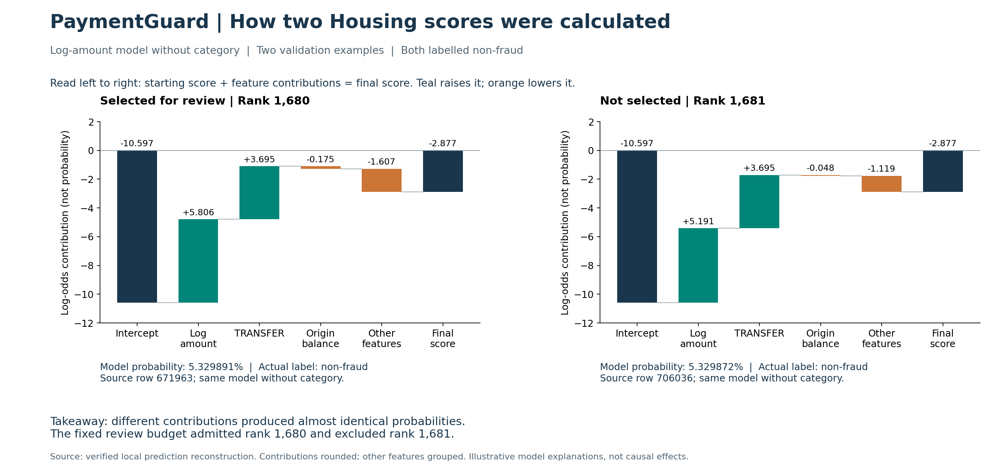

# How I explain the validation results visually

I split the explanation into two figures. The overview answers what changed
when category was removed. The second figure explains how the fitted model
calculated two individual scores. Both concern synthetic AMLNet validation
data, not final holdout or real-payment results.

## 1. Model performance and where the reviews went


Every approach gets the same 1,680 reviews among 167,990 validation rows,
including 202 positive labels. This keeps workload fixed while comparing
how many positive labels are found.

| Approach | Caught | Missed | False alarms |
| --- | ---: | ---: | ---: |
| Amount ranking | 109 | 93 | 1571 |
| Full log-amount model | 196 | 6 | 1484 |
| Log model without category | 130 | 72 | 1550 |
| Log model without type and category | 113 | 89 | 1567 |

The full log model has 196/202 = 97.03% recall and 196/1680 = 11.67%
precision. These answer different questions: how much labelled fraud was
caught, and how many reviewed transactions were labelled fraud.

The right panel compares review allocation, not fraud counts:

| Category | Full log model reviews | Without category reviews |
| --- | ---: | ---: |
| Housing | 22 | 1519 |
| Other | 1517 | 109 |
| Recreation | 69 | 12 |
| Shell Company | 68 | 40 |
| Education | 4 | 0 |

Both columns sum to 1,680. Food, Healthcare, Transport and Utilities have
zero reviews in both models and are omitted. All 1,519 selected Housing rows
were labelled non-fraud. They used 1519/1680 = 90.42% of the review budget.

My explanation: removing category and retraining reduced detection and
redirected review capacity toward Housing false alarms. This demonstrates
model dependence in this experiment. It does not prove category is leaked
information, and removing category changed the entire fitted model.

## 2. Two scores immediately around the cutoff



These are Housing transfers scored by `logistic_log_without_category`:

| Quantity | Selected | Not selected |
| --- | ---: | ---: |
| Source row | 671963 | 706036 |
| Overall rank | 1680 | 1681 |
| Model probability | 0.05329891350663496 | 0.05329871860249329 |
| Actual label | 0 | 0 |

The calculation is:

$$z=b+\sum_j \beta_j x_j, \qquad p=\frac{1}{1+e^{-z}}.$$

Here, x is the transformed feature vector, beta is the fitted coefficient
vector, and b is the intercept. Amount is log1p-transformed and standardized
with training statistics. Origin balance is also standardized. A TRANSFER
indicator equals one for both examples. These are not raw amounts multiplied
by coefficients.

The waterfall starts at zero and shows the intercept, then successive
contributions, ending at the final log-odds. Teal raises the score; orange
lowers it. The final navy bar is the resulting total, not another addition.
The probability is shown below each panel; the vertical axis is not probability.

| Contribution | Selected | Not selected |
| --- | ---: | ---: |
| Intercept | -10.596675731943682 | -10.596675731943682 |
| Transformed amount | 5.806329 | 5.191004 |
| TRANSFER | 3.694723 | 3.694723 |
| Origin balance | -0.174908 | -0.047504 |
| Remaining contributions, approximately | -1.606536 | -1.118618 |
| Final log-odds | -2.877067454324905 | -2.877071317021401 |

The amount contribution is larger for the selected transaction, but the other
inputs almost entirely offset the difference. The two probabilities differ
by about 0.0000195 percentage points. A fixed capacity limit still selects
one and excludes the other; it does not establish a sharp risk distinction.

For visual clarity, calendar, payment-method, device and location terms are
grouped as Other features. The plot uses the six-decimal printed amount,
TRANSFER and balance contributions. It computes the remaining group as the
final log-odds minus the intercept and these displayed terms. This absorbs
tiny transcription-rounding differences and makes the waterfall sum to the
recorded score. The local diagnostic prints the individual terms directly
from the model, rather than reconstructing them from this aggregate table.

Two cases do not explain the entire Housing population. Contributions depend
on the fitted encoding and are not causal effects or universal feature
importance. Probabilities have not been established as calibrated real-world
fraud frequencies. Neither case is used to introduce a Housing-specific rule.

## Sources and reproduction

- [Ablation results](feature_ablation_results.md) and
  [aggregate metrics](../results/tables/logistic_ablation_summary.csv): model comparison.
- [Category errors](validation_category_errors.md): review allocation and labels.
- [Housing score account](housing_score_contributions.md): two local reconstructions.
- `scripts/explain_housing_cutoff.py`: local diagnostic committed at `2b6ae75`;
  its documentation fence was corrected at `c3b64e1`.

The standalone plotting script embeds the recorded aggregate values above.
It generates figures without loading raw transactions, predictions or models:

```bash
python scripts/plot_validation_explanation.py
```

It requires the project's NumPy and Matplotlib dependencies and writes:

- `results/figures/paymentguard_model_overview.png`
- `results/figures/paymentguard_score_explanation.png`

Regenerating these pictures is not an independent rerun of the experiment.
To check the scores against the trusted local saved model and prepared data:

```bash
PYTHONPATH=src python scripts/explain_housing_cutoff.py
```

The local diagnostic reproduced row alignment, ranking, confusion counts and
the two probabilities. Artifact hashes and all other predictions were not
independently checked. No model was refitted or final test evaluation performed
for this visual addition.
